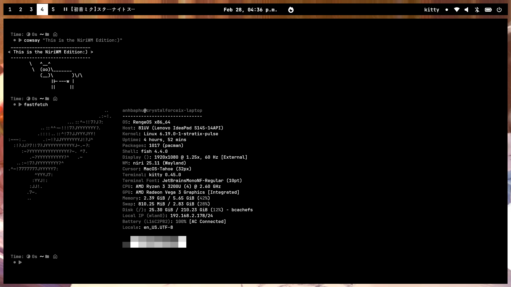

**Niri** is a **Scrollable Wayland Compositor** for **Linux**, developed by **[YaLTeR](https://github.com/YaLTeR)** and **[His Community](https://github.com/niri-wm)**, written in the **Rust language** and provides a **modern scrolling tiling** workflow for an **efficient working environment**. It's the **default** window manager of **RengeOS**.
<br />
**This's** an image of the **NiriWM Edition**:



## Configuration

**Here** you will learn about them and configure them.

### Overview

- **Bar**: Waybar
- **App Launcher**: Fuzzel
- **Wallpaper Engine**: Hyprlax, Matugen
- **Notification**: Swaync
- **Clipboard Manager**: Fuzzel, Cliphist
- **Powermenu**: Wlogout-git
- **Lockscreen**: Hyprlock
- **Power-Profiles-Manager**: Tuned, Tuned-ppd
- **Audio**: Pipewire

+ **All** Niri configurations are saved here: ``~/.config/niri/``

### Turn on bluetooth

- **First**, we need to download the following packages:
```sh
sudo pacman -Sy bluez bluez-utils blueman
```
- **Next**, we need to activate the bluetooth service.
```sh
# Enable bluetooth service
sudo systemctl enable bluetooth.service
# Start bluetooth service
sudo systemctl start bluetooth.service
```
- **Now** you will see a **bluetooth icon** on the bar then tap it and connect, or you can connect through the ``blueman`` app.

### Keybinds

#### Audio

| Key | Action |
|-----|--------|
| `XF86AudioRaiseVolume` | Raise volume |
| `XF86AudioLowerVolume` | Lower volume |
| `XF86AudioMute` | Toggle mute |
| `XF86AudioMicMute` | Toggle microphone mute |

#### Brightness

| Key | Action |
|-----|--------|
| `XF86MonBrightnessUp` | Increase brightness |
| `XF86MonBrightnessDown` | Decrease brightness |

#### Media

| Key | Action |
|-----|--------|
| `Mod + Shift + P` | Play / Pause |
| `Mod + Shift + N` | Next track |
| `Mod + Shift + B` | Previous track |

#### Applications

| Key | Action |
|-----|--------|
| `Mod + Return` | Open terminal (Kitty) |
| `Mod + E` | Open file manager (Nautilus) |
| `Mod + Alt + Slash` | Open app launcher (Fuzzel) |
| `Mod + L` | Lock screen (Hyprlock) |
| `Mod + Space` | Toggle overview |
| `Mod + Alt + W` | Select wallpaper |

#### Clipboard

| Key | Action |
|-----|--------|
| `Mod + V` | Open clipboard history |
| `Mod + Alt + V` | Delete a clipboard entry |

#### Window Navigation

| Key | Action |
|-----|--------|
| `Mod + Left` | Focus column left |
| `Mod + Right` | Focus column right |
| `Mod + Up` | Focus workspace up |
| `Mod + Down` | Focus workspace down |
| `Mod + Tab` | Focus previous workspace |
| `Mod + Ctrl + Left` | Focus first column |
| `Mod + Ctrl + Right` | Focus last column |

#### Window Movement

| Key | Action |
|-----|--------|
| `Mod + Shift + Left` | Move column left |
| `Mod + Shift + Right` | Move column right |
| `Mod + Shift + Up` | Move column to workspace up |
| `Mod + Shift + Down` | Move column to workspace down |
| `Mod + Shift + Ctrl + Left` | Move column to first |
| `Mod + Shift + Ctrl + Right` | Move column to last |
| `Mod + Ctrl + Alt + Up` | Move workspace up |
| `Mod + Ctrl + Alt + Down` | Move workspace down |

#### Layout

| Key | Action |
|-----|--------|
| `Mod + F` | Maximize column |
| `Mod + Shift + F` | Fullscreen window |
| `Mod + C` | Center column |
| `Mod + Ctrl + F` | Expand column to available width |
| `Mod + -` | Decrease column width by 10% |
| `Mod + =` | Increase column width by 10% |
| `Mod + Shift + -` | Decrease window height by 10% |
| `Mod + Shift + =` | Increase window height by 10% |
| `Mod + Alt + Left` | Consume or expel window left |
| `Mod + Alt + Right` | Consume or expel window right |

#### Workspaces

| Key | Action |
|-----|--------|
| `Mod + 1` — `Mod + 9` | Switch to workspace 1–9 |
| `Mod + Shift + 1` — `Mod + Shift + 9` | Move column to workspace 1–9 |

#### Floating

| Key | Action |
|-----|--------|
| `Mod + Alt + Space` | Toggle window floating |
| `Alt + Space` | Switch focus between floating and tiling |

#### Screenshot

| Key | Action |
|-----|--------|
| `Print` | Screenshot (region select) |
| `Ctrl + Print` | Screenshot entire screen |
| `Alt + Print` | Screenshot focused window |

#### System

| Key | Action |
|-----|--------|
| `Mod + Q` | Close window |
| `Mod + Alt + P` | Power off monitors |

#### Mouse

| Key | Action |
|-----|--------|
| `Mod + Alt + ScrollUp` | Raise volume |
| `Mod + Alt + ScrollDown` | Lower volume |
| `Mod + Shift + Alt + ScrollUp` | Increase brightness |
| `Mod + Shift + Alt + ScrollDown` | Decrease brightness |
| `Mod + Ctrl + ScrollUp` | Focus workspace up |
| `Mod + Ctrl + ScrollDown` | Focus workspace down |
| `Mod + Ctrl + MouseLeft` | Focus column left |
| `Mod + Ctrl + MouseRight` | Focus column right |
| `Mod + Ctrl + Shift + MouseLeft` | Move column left |
| `Mod + Ctrl + Shift + MouseRight` | Move column right |
| `Mod + Ctrl + Shift + ScrollUp` | Move column to workspace up |
| `Mod + Ctrl + Shift + ScrollDown` | Move column to workspace down |

#### Touchpad

| Key | Action |
|-----|--------|
| `Mod + Alt + TouchpadScrollDown` | Raise volume |
| `Mod + Alt + TouchpadScrollUp` | Lower volume |
| `Mod + Ctrl + TouchpadScrollDown` | Increase brightness |
| `Mod + Ctrl + TouchpadScrollUp` | Decrease brightness |
| `Mod + TouchpadScrollDown` | Focus workspace down |
| `Mod + TouchpadScrollUp` | Focus workspace up |
| `Mod + TouchpadScrollLeft` | Focus column left |
| `Mod + TouchpadScrollRight` | Focus column right |
| `Mod + Shift + TouchpadScrollLeft` | Move column left |
| `Mod + Shift + TouchpadScrollRight` | Move column right |
| `Mod + Shift + TouchpadScrollDown` | Move column to workspace down |
| `Mod + Shift + TouchpadScrollUp` | Move column to workspace up |
