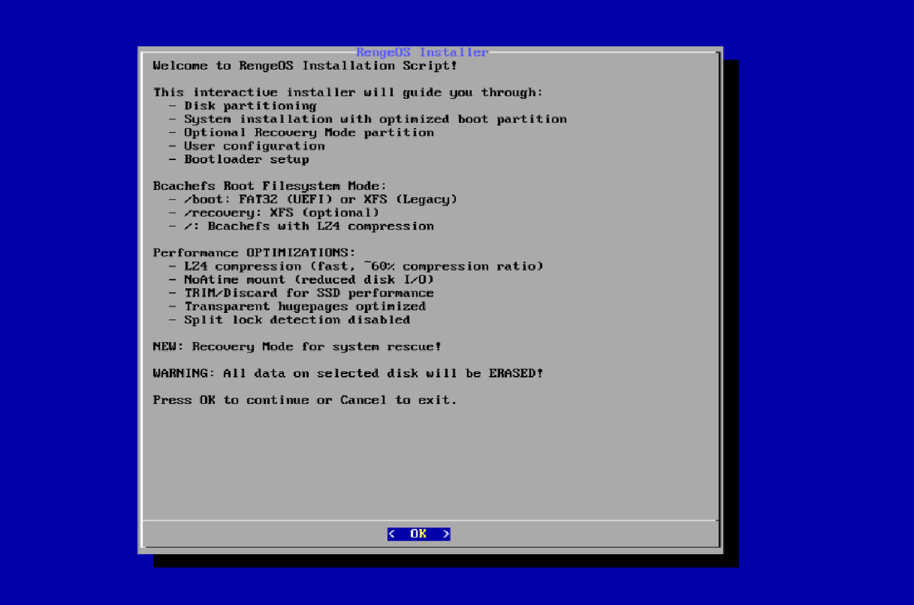

**Essentially**, we'll use ros-installer to automate the installation process from a Live ISO to the machine using the ``unsquashfs`` method and some other related techniques during the process.

import { Aside } from '@astrojs/starlight/components';

<Aside type="note">
  **Currently**, only **Offline Installation** is **supported**,
  and there are no plans to switch the installation process to online for the following reasons:
+ **Online Installation** can be quite risky if the network encounters problems during the installation process,
  such as installing a package, as restarting the process would be very inconvenient.
+ The **Online Installation** process is not compatible with the original design of this distribution (**RengeOS**).
+ Maintaining **other packages** and **infrastructure** using online methods would be quite expensive for me :(
</Aside>

## Boot into Live ISO
- **First**, we need to plug in the bootable USB drive containing the ISO file.
  Then, depending on your computer's hardware manufacturer,
  access the boot menu and boot from that USB drive.

- **Then** you will see the boot menu will look like this (UEFI). For Legacy BIOS, it will display similarly but with a slightly different interface.


<Aside type="tip">
  **If** you don't know what to choose, just select Linux Latest.
</Aside>

<Aside type="caution" title="Note">
``**If** you encounter a black screen error when selecting Linux Latest on Intel 10th generation chips (reported black screen issues), try selecting Linux LTS.
</Aside>

## Start the installation process
- **After** the systemd process is complete, you will see a screen like this (RengeOS is inherently a minimal distribution).


- **Next**, we will need to begin the installation process with ``ros-installer``

```sh
ros-installer
```
- **Immediately** after you run the installer, this interface will appear on the screen.




## Choose a hard drive to install on

- **From here** you can see the choice of hard drive to which **RengeOS** will be **installed**.

<Aside type="note">
 By default, it will automatically detect whether your machine is using UEFI or Legacy BIOS, so you don't need to worry about this :)
</Aside>

- **Here**, the drive I want to install it on is ``sda``

|  |  |
|--------------|--------------|

## Disk partition

- **Now** we will choose a method for partitioning the hard drive.


### Choose a partitioning method

- Select ``Yes`` **if** you intend to dual-boot with different operating systems or create a separate partition for different needs.

<LinkCard title="Manual partitioning" href="#manual-partitioning" />

- Select ``No`` **if** you want automatic partitioning based on one hard drive (suitable for beginners and lazy people like me lol)

import { LinkCard } from '@astrojs/starlight/components';

<LinkCard title="Automatic partitioning" href="#automatic-partitioning" />

### Automatic partitioning
<Aside type="note">
  **We** have the following design:
  + ``/boot`` is the boot partition for Linux (size can be selected).
    **If** using ``UEFI``, it will be formatted as ``FAT32``, and **if** using ``Legacy BIOS``, it will be formatted as ``XFS``.
  + ``/recovery`` is the recovery partition for Linux (size can be selected and can enable/disable if you want).
    **Both** ``UEFI`` and ``Legacy BIOS`` will always be in ``XFS`` format.
  + **The** ``/`` partition is the ``root`` partition for Linux (it will take the remaining size after partitioning for ``/boot`` and ``/recovery``).
    **Both** ``UEFI`` and ``Legacy BIOS`` can choose from the following formats: ``Bcachefs``, ``XFS`` (currently supported);
    if using an **LTS kernel**, only ``XFS`` is supported.
</Aside>

- **Next**, choose your desired size for the ``/boot`` partition (the default is **1GB**).


- **After that**, it will ask if you want to enable **Recovery Mode**.
- **If** you're someone who likes to **experiment** and accidentally **messes up** your system like **me** :)
  then you should probably enable **Recovery Mode** because it can help **restore** your system to its original state as
  when it was first installed using ``ros-reborn``,
  or you can ``mount`` a damaged root partition to repair it or do many other things.

|  |  |
|--------------|--------------|


- **If** you select **Yes**, after the installation is complete you will see it in the **GRUB** menu as shown below.


- **If** you choose **No**, that's perfectly fine because recovery mode is essentially a second root partition on the device,
  created to help users repair the main root partition more easily without needing a Live ISO.

- **Now** we can move on to the Kernel selection step.

<LinkCard title="Kernel selection" href="#kernel-selection" />

### Manual partitioning

- **Now** let's consider the conditions below before using the cfdisk tool to partition the hard drive.


- **Next**, inside ``cfdisk``, we will create partitions.

<Aside type="caution">
  **You** can create as many partitions as you want, but you must ensure that there is a ``boot`` partition
  and a ``root`` partition (a ``recovery mode`` partition is optional).
</Aside>

+ **Here** I have created the following partitions: ``/dev/sda1``: **1GB**, ``/dev/sda2``: **7GB**, ``/dev/sda3``: **60.7GB**
+ **The partitions** will be **divided in order**: the ``boot`` partition, the ``recovery mode`` partition, and the ``root`` partition.


+ **After** we have created the partitions and exited cfdisk, we will immediately move on to the partition definition step.
+ **We** will choose the ``boot`` partition; in this case, my ``boot`` partition is ``sda1``.


+ **Next**, we will select the ``root`` partition; in this case, my ``root`` partition is ``sda3``.


+ **Now** we will be asked if we want to define a ``recovery mode`` partition.
+ **If** we haven't created a recovery mode partition, we can select **No** to skip this step.
+ **If** we have already created a ``recovery mode`` partition, select **Yes** as in my case to define the ``recovery mode`` partition.


+ **Next**, we will select the ``recovery mode`` partition; in this case, my ``recovery mode`` partition is ``sda2``.


+ **Now** we can move on to the Kernel selection step.

<LinkCard title="Kernel selection" href="#kernel-selection" />

## Kernel selection
- **The next step** is to select the **kernel** that will be installed and used as the **default**.

+ ``linux-renge-bore`` is the latest kernel based on the **Xanmod Kernel** and **BORE Schedule**,
  with **O3 optimization** and **other features** that make laptops/desktops/gaming significantly smoother,
  reducing lag and stutter during heavy background tasks. However, it is not optimized for long-term workloads or servers.
  
+ ``linux-renge-lts`` is also the latest kernel (in terms of official Linux kernel versions for LTS) based on the **Xanmod Kernel**,
  built with **O3 optimization**.
  It excels in smoothness, low latency, and better laptops/desktop/gaming performance than the regular kernel,
  but maintains **long-term** stability and is less optimized than ``linux-renge-bore``.

<Aside type="tip">
 **Choose** ``linux-renge-bore`` if you're unsure which one to choose, as it offers the most comprehensive support (**recommended** by the **author**).
</Aside>

<Aside type="caution">
**If** you are experiencing a black screen boot issue when booting into **Linux Latest** but not with **Linux LTS**, then select ``linux-renge-lts``.
</Aside>


## Filesystem

<Aside type="note">
  **Currently**, RengeOS only supports bcachefs and xfs, but in the future it will probably support more :) for example, btrfs, f2fs, etc.
</Aside>

- **After** selecting your desired kernel, you will see something like this (for the ``linux-renge-bore`` option).
- **If** we selected ``linux-renge-lts``, only the **xfs filesystem** option will be **displayed** because it doesn't support **bcachefs filesystem**.
- **Anyway**, that's your decision, but I still recommend choosing **bcachefs filesystem** if possible because RengeOS currently has strong support for it.


## Configure Zram (Virtual RAM)

- **After** successfully completing filesystem selection configuration process, the next step is to choose whether or not to enable Zram.

<Aside type="note">
**The following** scenarios may occur:
+ **If** you see that your device has **less than 8GB** of physical RAM, it's recommended to prioritize selecting ``Yes`` as
  it can help prevent RAM overflow later on during crashes,
  building apps from source code, playing demanding games, etc.
+ **If** you already have **too much** RAM or **enough** for your needs without needing more virtual RAM, you can choose ``No``.
</Aside>


## Timezone and System locale
- **Now** we need to select the time region, here, I've chosen ``Asia/Ho_Chi_Minh`` because I live there


- **After** selecting your region, the next step is to choose your system locale.
- **If** you're unsure what to choose, just select ``English (US)`` as it's the **default** standard on most **other distributions**, and I chose it too.


## System configuration

- **Now** it will ask you for your computer's hostname, so enter the name you want.


**After** completing that, the next step is to provide the user's username

<Aside type="caution">
  Remember that you will use it to log in as a user.
</Aside>


## Configure passwords for Root and User

- **After that**, we will move on to configuring passwords for ``root`` and ``user`` accounts.
+ **And now** we'll begin with setting up the ``root`` password.

 |  |
|-----------------|----------------|

- **Once** we've set up the root password, we'll move on to setting up passwords for the ``user`` accounts.

 |  |
|-----------------|----------------|

## Check before the installation process begins

- **Now** we need to review and confirm whether it has met expectations.
- **If** you're okay with it, you can select **Yes**. Otherwise, select **No**, and you can start the process again.

<Aside type="caution">
  **Note that** selecting Yes will begin the formatting and configuration process according to your choices.
  **Make sure** you have backed up all important data as it will erase everything.
</Aside>

 |  |
|--------------|--------------|

- **The process** will then continue according to the previously configured settings.


## Wait for the installation process to complete

- **Now** you can make yourself a hot cup of coffee and wait until everything is finished, and you will reach the completion menu.

 |  |
|---------------|--------------|

- **Congratulations! You have successfully installed RengeOS on your system!!** 🎉 🎉
